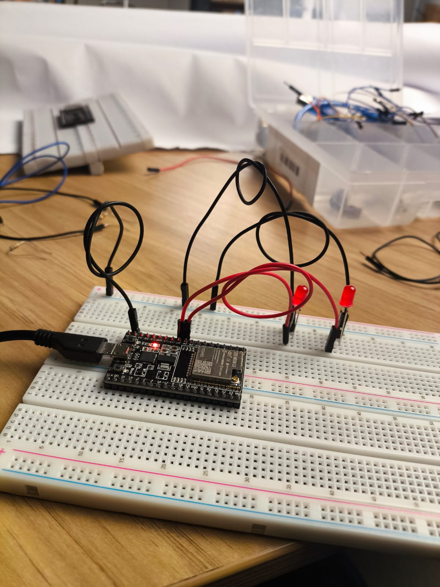
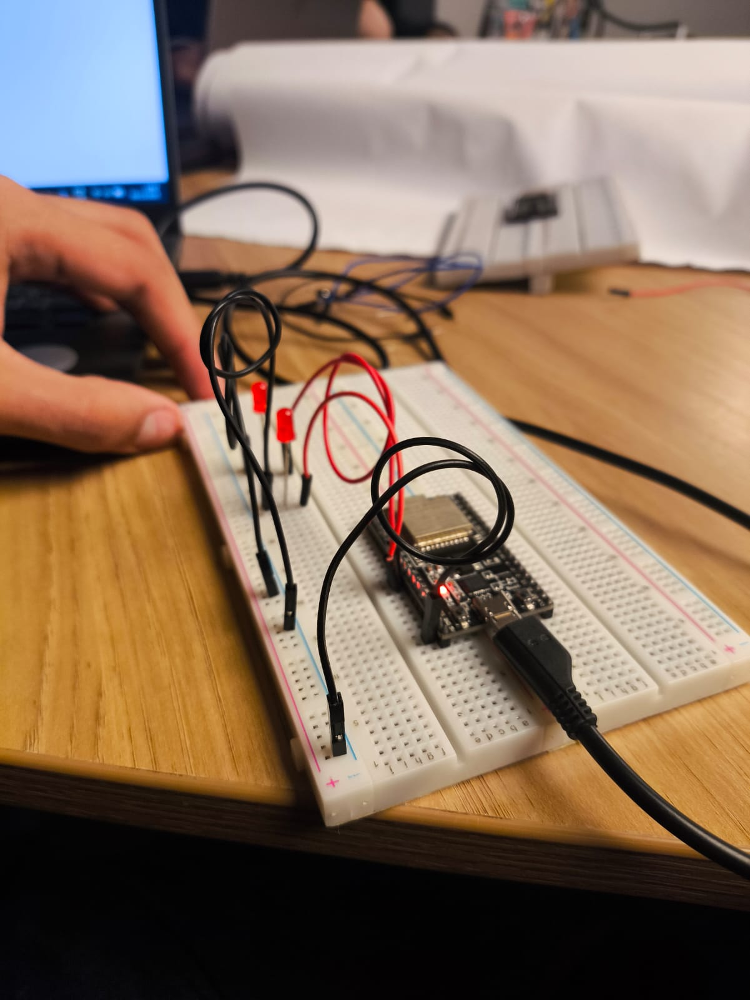
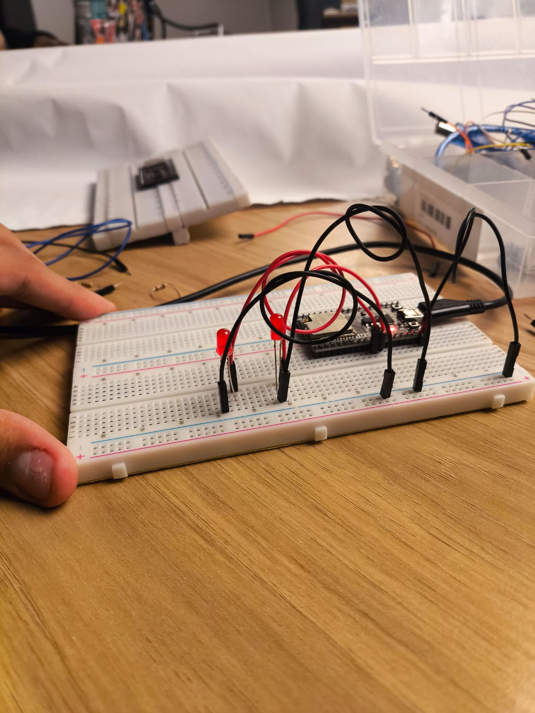
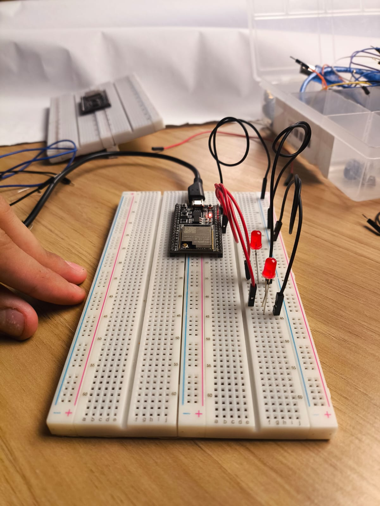

# Relatório Técnico de Análise de Riscos: ESP32 Web Server

Este documento consolida a análise de segurança estática do código-fonte do servidor web do ESP32, identificando vulnerabilidades críticas, detalhando a avaliação de risco dos ataques e propondo medidas de mitigação.

---

## 1.Resumo das Vulnerabilidades Críticas

O servidor web atual é **altamente vulnerável**, pois **não implementa nenhuma autenticação ou criptografia**, e as credenciais de rede estão expostas.

| ID  | Vulnerabilidade                              | Descrição                                                                                                                                             |
| :-- | :------------------------------------------- | :---------------------------------------------------------------------------------------------------------------------------------------------------- |
| 01  | **Controle Não Autorizado**                  | Qualquer cliente na rede pode enviar comandos (ex: `/26/on`) e controlar o hardware, sem verificação de identidade (autenticação).                    |
| 02  | **Comunicação em Texto Simples**             | O uso de HTTP (porta 80) expõe todos os comandos e respostas a ataques de _sniffing_ na rede.                                                         |
| 03  | **Exposição de Credenciais no Código-Fonte** | As credenciais de Wi-Fi (`ssid` e `password`) estão codificadas diretamente, tornando-as visíveis a qualquer pessoa com acesso ao código ou firmware. |
| 04  | **Falta de Limitação de Taxa**               | O código não possui mecanismos para limitar o número de requisições por cliente, facilitando ataques de Negação de Serviço (DoS).                     |

---

## 2. Análise Detalhada dos Ataques e Risco

Abaixo estão os ataques mais críticos identificados, com suas avaliações de risco detalhadas (Probabilidade, Impacto e Risco).

### Ataque 1: Comprometimento da Rede Wi-Fi (Risco: CRÍTICO)

Explora a vulnerabilidade **V-03 (Exposição de Credenciais)**.

- **Passo-a-Passo:**
  1.  O atacante obtém acesso ao **código-fonte** do projeto.
  2.  O atacante extrai o **Password do Wi-Fi** diretamente das constantes globais (`const char* password = ...`).
  3.  O atacante usa a senha roubada para se conectar à **rede Wi-Fi principal**, obtendo acesso a todos os outros dispositivos conectados.
- **Probabilidade:** **Média/Alta**. _Justificativa:_ O código-fonte é frequentemente compartilhado (ex: Git, repositório interno). A credencial está em texto claro no código.
- **Impacto:** **Crítico**. _Justificativa:_ O ataque compromete **toda a rede**, não apenas o ESP32, possibilitando roubo de dados e acesso a sistemas críticos.

### Ataque 2: Comando Remoto e Sabotagem (Risco: ALTO)

Explora a vulnerabilidade **V-01 (Falta de Autenticação)**.

- **Passo-a-Passo:**
  1.  O atacante se conecta à mesma **rede Wi-Fi local**.
  2.  Usa ferramentas de varredura (ex: Nmap) para descobrir o **endereço IP** do ESP32.
  3.  Envia requisições HTTP diretas (ex: `http://<IP_do_ESP32>/26/on`) para controlar os GPIOs.
- **Probabilidade:** **Muito Alta**. _Justificativa:_ O ataque é trivial; qualquer pessoa na rede pode fazê-lo sem autenticação ou ferramentas avançadas.
- **Impacto:** **Alto**. _Justificativa:_ Pode causar danos físicos (se o GPIO controlar um relé ou motor) ou operacionais, dependendo do equipamento conectado.

---

## 3.Tabela Consolidada de Riscos (Decrescente)

Os ataques são ordenados do **maior risco** para o **menor risco**.

| Título do Ataque                  | Vulnerabilidade Explorada     | Probabilidade | Impacto | Risco       |
| :-------------------------------- | :---------------------------- | :------------ | :------ | :---------- |
| **Comprometimento da Rede Wi-Fi** | V-03 (Exposição de Senha)     | Média/Alta    | Crítico | **CRÍTICO** |
| **Comando Remoto e Sabotagem**    | V-01 (Falta de Autenticação)  | Muito Alta    | Alto    | **ALTO**    |
| Sniffing (Escuta Passiva)         | V-02 (HTTP Não Criptografado) | Média         | Médio   | **MÉDIO**   |

---

## 4.Mitigação e Recomendações

As seguintes ações são críticas para garantir a segurança da solução IoT:

### Ação 1: Proteger Credenciais

- **Correção:** As credenciais de Wi-Fi (`ssid` e `password`) devem ser lidas de um local seguro, como a **memória flash (Preferences/EEPROM)**, e **NÃO** codificadas no código-fonte. Isso impede que a senha da rede seja distribuída junto com o código.

### Ação 2: Implementar Autenticação

É obrigatório restringir o acesso apenas a clientes autorizados.

- **Método Recomendado:** Usar um **Token de Acesso Secreto** na URL. O código deve verificar se a string de solicitação contém o token correto (ex: `header.indexOf("token=CHAVE_SECRETA_UNICA")`).
- **Melhoria Adicional:** Implementar a **Autenticação HTTP Digest** (mais segura que a HTTP Basic) para acesso à página principal.

### Ação 3: Criptografar a Comunicação

O tráfego de comandos deve ser criptografado para proteger contra _sniffing_ e ataques Man-in-the-Middle (MITM).

- **Correção:** Migrar de **HTTP** para **HTTPS (SSL/TLS)**.
  - Requer o uso da biblioteca **`WiFiClientSecure.h`** e um certificado digital.
  - Altere o servidor para escutar na porta **443** (padrão HTTPS): `WiFiServer server(443);`.

### Ação 4: Limitação de Taxa (Mitiga V-04)

- **Correção:** Adicionar um mecanismo simples para rastrear o endereço IP do cliente e **bloquear temporariamente** o acesso se ele fizer muitas requisições em um curto período de tempo (prevenção de **Denial of Service - DoS**).

---

## 5. Protótipo Físico e Configuração do Ambiente

### Componentes Utilizados

O protótipo físico é composto pelos seguintes componentes:

- **1x ESP32** - Microcontrolador com Wi-Fi integrado
- **2x LEDs Vermelhos** - Indicadores visuais controlados pelos GPIOs
- **4x Jumpers** - Fios para conexões elétricas

### Descrição do Hardware

O protótipo implementado consiste em um **ESP32** configurado como servidor web local que controla dois pinos GPIO (GPIO 26 e GPIO 27), cada um conectado a um LED vermelho através de jumpers. O dispositivo permite o controle remoto via interface web através de uma conexão Wi-Fi local.

### Conexão Física do Protótipo

A montagem física do protótipo segue a seguinte configuração:

1. **GPIO 26** → Conectado ao **ânodo (+) do LED 1** via jumper
   - **Cátodo (-) do LED 1** → Conectado ao **GND** via jumper com resistor interno do ESP32
2. **GPIO 27** → Conectado ao **ânodo (+) do LED 2** via jumper
   - **Cátodo (-) do LED 2** → Conectado ao **GND** via jumper com resistor interno do ESP32

### Conexão com o Código do ESP32 (`esp.ino`)

O código em `esp.ino` controla diretamente os LEDs através das seguintes funcionalidades:

- **Linhas 24-25:** Definição dos pinos GPIO 26 e 27 como saídas digitais
- **Linhas 37-41:** Configuração inicial dos GPIOs como saída e estado LOW (LEDs desligados)
- **Linhas 85-101:** Lógica de controle dos LEDs baseada em requisições HTTP:
  - `GET /26/on` → Acende o LED conectado ao GPIO 26 (`digitalWrite(output26, HIGH)`)
  - `GET /26/off` → Apaga o LED conectado ao GPIO 26 (`digitalWrite(output26, LOW)`)
  - `GET /27/on` → Acende o LED conectado ao GPIO 27 (`digitalWrite(output27, HIGH)`)
  - `GET /27/off` → Apaga o LED conectado ao GPIO 27 (`digitalWrite(output27, LOW)`)

**Funcionamento:**

1. O ESP32 conecta-se à rede Wi-Fi usando as credenciais hardcoded (linhas 10-11)
2. Inicia um servidor HTTP na porta 80 (linha 14)
3. Quando um cliente envia uma requisição HTTP, o código analisa o header (linha 72)
4. Se encontrar os padrões `/26/on`, `/26/off`, `/27/on` ou `/27/off`, altera o estado dos GPIOs correspondentes
5. O estado dos LEDs reflete visualmente o estado dos GPIOs controlados remotamente

### Conexão com o Código de Ataque (`ataque.ino`)

O script Python em `ataque.ino` demonstra uma vulnerabilidade crítica (V-04: Falta de Limitação de Taxa) explorando o servidor web do ESP32:

- **Linha 5:** Define o IP do ESP32 alvo (obtido do Monitor Serial após conexão Wi-Fi)
- **Linhas 12-13:** Estabelece conexão TCP direta com a porta 80 do ESP32
- **Linhas 16-24:** Envia pacotes de dados contínuos (1000 caracteres "A" por pacote) sem completar a requisição HTTP
- **Resultado:** O ESP32 mantém a conexão aberta, acumulando dados no buffer `header` (linha 72 do `esp.ino`), causando exaustão de memória e possível travamento/reinicialização

**Exploração da Vulnerabilidade:**

- O código não valida o tamanho máximo do header HTTP
- Não implementa rate limiting por IP
- O timeout de 2000ms (linha 32 do `esp.ino`) não é suficiente para mitigar o ataque
- A variável `header` (linha 17) cresce indefinidamente, consumindo toda a RAM disponível

### Configuração da Rede

O ESP32 foi configurado para conectar-se à rede Wi-Fi com as seguintes credenciais (expostas no código-fonte):

- **SSID:** `Galaxy Samsung J1 mini`
- **Password:** `123456777`

> **⚠️ Nota de Segurança:** As credenciais acima estão expostas intencionalmente para fins educacionais de análise de vulnerabilidades. Em um ambiente de produção, essas credenciais jamais devem ser hardcoded no código-fonte.

### Funcionalidades do Protótipo

O servidor web permite que qualquer cliente conectado à mesma rede Wi-Fi acesse uma interface HTML simples para:

- Ligar/desligar o LED conectado ao GPIO 26
- Ligar/desligar o LED conectado ao GPIO 27
- Visualizar o estado atual de cada GPIO/LED na interface web

### Documentação Visual

A seguir estão disponíveis imagens e vídeos do protótipo físico montado e em funcionamento:

#### Imagens do Protótipo

  

<em>Figura 1: Vista geral do protótipo com ESP32, LEDs e jumpers</em>

  

<em>Figura 2: Detalhes dos componentes e conexões</em>

  

<em>Figura 3: Detalhe das conexões dos GPIOs aos LEDs</em>

  

<em>Figura 4: Visão geral</em>

#### Vídeos Demonstrativos

  <a href="media/video1.mp4">video1.mp4</a> - Demonstração do funcionamento básico do controle remoto via interface web 
  <a href="media/video2.mp4">video2.mp4</a> - Teste completo de controle remoto dos LEDs e demonstração das vulnerabilidades

